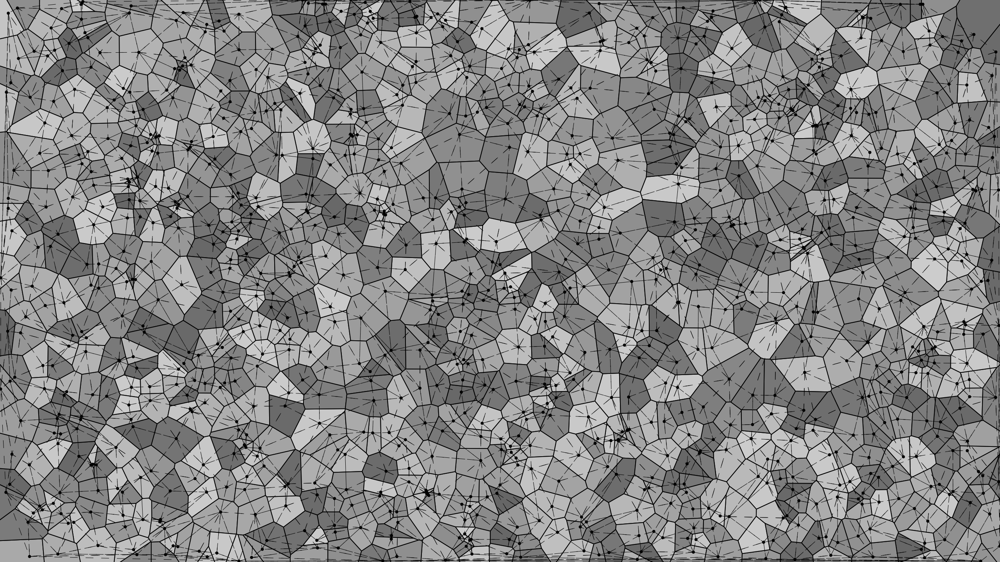

# Swift Delaunay triangulation + Voronoi Diagram

A Swift implementation of the [Bowyer–Watson algorithm](https://en.wikipedia.org/wiki/Bowyer%E2%80%93Watson_algorithm).
The result is a [Delaunay triangulation](https://en.wikipedia.org/wiki/Delaunay_triangulation) for a set of randomly generated points.
Following the Delaunay triangulation, the dual [Voronoi diagram](https://en.wikipedia.org/wiki/Voronoi_diagram) is constructed.

A example of the Delaunay triangulation and the Voronoi diagram for 1000 points.

## License

This project is licensed under the MIT License - see the [LICENSE](LICENSE) file for details
